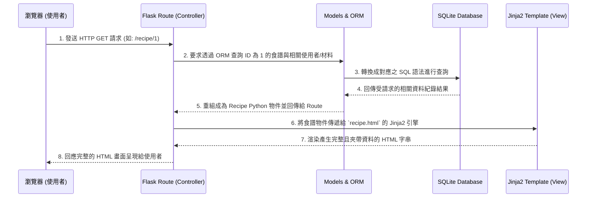

# 系統架構文件 (Architecture) - 食譜收藏夾

## 1. 技術架構說明

根據本專案 PRD 提到之「注重內容展示與直覺操作」的需求，搭配中小型專案快速開發的特性，我們將採用以下技術棧：

- **後端框架：Python + Flask**
  輕量化、彈性高的後端框架，不預設太多規則，非常適合用來快速打造 MVP 與迭代開發。
- **模板引擎：Jinja2**
  與 Flask 高度整合，專職負責將後端邏輯層處理完畢的資料，動態渲染成 HTML 頁面呈現給瀏覽器。因為我們不需要用到複雜的前後端分離框架，所以這也是實作 SEO 友善架構最佳的方法。
- **資料庫：SQLite (搭配 SQLAlchemy ORM)**
  內建於 Python 之中且免安裝伺服器，是最適合做為 MVP 與本機開發使用的輕量資料庫。結合 SQLAlchemy ORM 可大幅簡化資料庫關聯 (如: 食譜關聯多個材料、步驟) 的查詢代碼長度與複雜度。

### Flask MVC 模式對應說明
- **Model (資料模型)**：由 SQLAlchemy 所定義的類別 (Classes) 來扮演，對應資料庫中的概念如 `User` (使用者), `Recipe` (食譜), `Step` (步驟), `Ingredient` (材料) 等。負責封裝系統的狀態，以及操作 SQLite 資料庫的各項新增、修改、刪除與查詢邏輯。
- **View (視圖)**：由 Jinja2 HTML 模板結合原生 CSS 與 JavaScript 構成，專責管理與決策「如何將接收到的資料安全且精美地呈現」給終端使用者。
- **Controller (控制器)**：由 Flask 的 Routes (路由函數) 擔任。扮演接收前端使用者 HTTP 請求 (Request) 的角色，並決定應該呼叫哪個 Model 來拿資料或寫入新資料，接著把這些資料往 Jinja2 的 View 層傳遞等待渲染產生結果。

---

## 2. 專案資料夾結構

本專案採符合 Flask 社群慣例的模組化結構打造，確保架構清晰與未來可擴充性：

```text
web_app_development/
├── app/                      ← 所有的系統原始碼 (涵蓋 MVC)
│   ├── __init__.py           ← Flask 應用程式初始化、綁定套件 (如 SQLAlchemy)
│   ├── models.py             ← Model: 資料庫模型負責定義資料結構 (User, Recipe)
│   ├── routes.py             ← Controller: Flask 路由控制與視圖函數
│   ├── templates/            ← View: Jinja2 HTML 模板目錄
│   │   ├── base.html         ← 基礎共用版型 (包含導覽列、頁首、頁尾)
│   │   ├── index.html        ← 首頁 (食譜清單、搜尋欄)
│   │   ├── recipe.html       ← 食譜詳細總覽頁 (材料與步驟流)
│   │   ├── edit_recipe.html  ← 食譜新增/編輯頁面
│   │   └── auth.html         ← 登入/註冊共用頁面
│   └── static/               ← 前端所需的靜態資源檔案
│       ├── css/
│       │   └── style.css     ← 客製化排版與樣式參數 (色彩、字體、佈局)
│       └── js/
│       │   └── main.js       ← 簡易前端互動邏輯驅動
├── instance/                 ← 不上傳版本控制的環境變數與本機專屬檔案
│   └── database.db           ← SQLite 實體資料庫檔案 (自動生成)
├── docs/                     ← 開發過程的各式各樣說明文件
│   ├── PRD.md                ← 產品需求文件
│   └── ARCHITECTURE.md       ← 系統架構文件 (本文件)
├── requirements.txt          ← 專案執行的所有 Python 依賴套件表
└── app.py                    ← 專案啟動入口程式，負責喚起 Flask 內建伺服器
```

---

## 3. 元件關係圖

以下展示了系統核心處理過程（如「使用者查閱單篇食譜頁面」）的生命週期互動關係：



---

## 4. 關鍵設計決策

1. **使用伺服器端渲染 (SSR) 取代前後端分離**
   - **原因**：為了快速開發 MVP 並專注於需求本身，免除了架設兩套前後端系統與撰寫一堆 RESTful API 的麻煩。此外，食譜網站如果採用伺服器端渲染，可以更自然地讓搜尋引擎爬蟲完整收錄網頁內容 (SEO 最佳化)。

2. **採用 SQLAlchemy ORM 框架，而非純 SQL 語法拼貼**
   - **原因**：食譜包含了關聯複雜性很高的「多對多、一對多關係」(像是：每篇食譜裡有自己專屬的許多材料列與步驟，且有很多的使用者能各自收藏它)。ORM 可以讓我們透過簡單乾淨的 Python 屬性取物方式 (例如 `recipe.ingredients`) 去達成關聯查詢，大大降低手寫多重 JOIN 指令帶來的錯誤率。

3. **設立獨立的 instance 資料夾**
   - **原因**：把資料庫檔案與其他機密組態配置隔離存放在這層中，並設為隱藏 (如 `.gitignore` 排除)。一方面保障測試資料與真機密不要被意外 Git push，另一方面這亦為業界撰寫 Flask 的標準架構，利於未來系統上線預備部署。

4. **單一 `routes.py` 預備轉向 Blueprints 面向擴充**
   - **原因**：雖然以當下的開發規劃，單支檔案能涵蓋大約數十個左右的端點 API (包含使用者邏輯、食譜邏輯、基本管理員)，但該架構已規劃支援未來當邏輯龐大而需要切割模組時，能夠平滑重構與銜接至 Flask Blueprints 架構。
