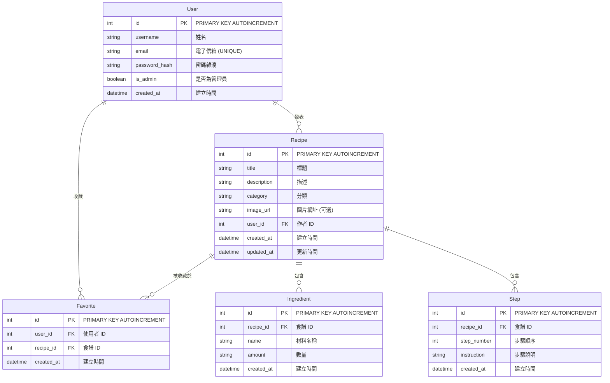

# Database Design (資料庫設計)

本文件根據 PRD 與系統架構需求，設計出食譜收藏夾網站所需的各項資料表與其關聯。

## ER 圖 (實體關係圖)

## 資料表詳細說明

### 1. User (使用者)
負責儲存使用者的登入與身分資訊。
- `id` (INTEGER): Primary Key, 自動遞增。
- `username` (TEXT): 必填，使用者名稱。
- `email` (TEXT): 必填，唯一值，用作登入帳號。
- `password_hash` (TEXT): 必填，經加密處理的密碼。
- `is_admin` (BOOLEAN): 預設為 False。
- `created_at` (DATETIME): 註冊時間。

### 2. Recipe (食譜)
包含食譜的核心文字資訊。
- `id` (INTEGER): Primary Key, 自動遞增。
- `title` (TEXT): 必填，食譜標題。
- `description` (TEXT): 必填，食譜介紹。
- `category` (TEXT): 必填，料理分類（如：中式、甜點）。
- `image_url` (TEXT): 非必填，封面圖片連結。
- `user_id` (INTEGER): Foreign Key，對應到 User.id。
- `created_at` (DATETIME): 建立時間。
- `updated_at` (DATETIME): 更新時間。

### 3. Ingredient (材料)
儲存食譜所需的所有備料與數量。
- `id` (INTEGER): Primary Key, 自動遞增。
- `recipe_id` (INTEGER): Foreign Key，對應到 Recipe.id。
- `name` (TEXT): 必填，材料名稱（如：「雞蛋」）。
- `amount` (TEXT): 必填，數量或單位（如：「2 顆」）。
- `created_at` (DATETIME): 建立時間。

### 4. Step (步驟)
儲存該食譜特定的烹飪步驟教學。
- `id` (INTEGER): Primary Key, 自動遞增。
- `recipe_id` (INTEGER): Foreign Key，對應到 Recipe.id。
- `step_number` (INTEGER): 必填，步驟順序（如：1、2、3）。
- `instruction` (TEXT): 必填，詳細的步驟說明操作。
- `created_at` (DATETIME): 建立時間。

### 5. Favorite (收藏紀錄)
存放使用者對特定食譜的收藏關係，屬於 Many-to-Many 的中介表。
- `id` (INTEGER): Primary Key, 自動遞增。
- `user_id` (INTEGER): Foreign Key，對應到 User.id。
- `recipe_id` (INTEGER): Foreign Key，對應到 Recipe.id。
- `created_at` (DATETIME): 收藏入匣的時間。
