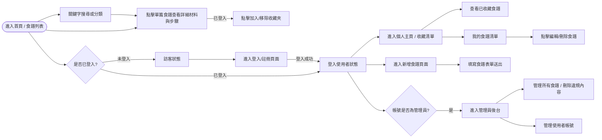
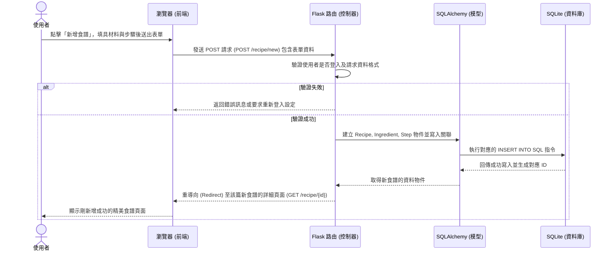

# 流程圖文件 (Flowchart) - 食譜收藏夾

本文件基於 PRD 需求與系統架構，梳理出使用者在「食譜收藏夾」網站中的操作路徑 (User Flow)，以及核心操作在系統背後的處理流程 (System Flow)，最後梳理出各項功能對應的 URL 路徑清單。

---

## 1. 使用者流程圖（User Flow）

以下流程圖說明了不同身分的使用者（訪客/已登入會員/管理員）進入網站後可以執行的操作路徑。

---

## 2. 系統序列圖（Sequence Diagram）

以下序列圖展示了一個核心操作：**「已登入使用者在此平台上新增食譜」** 時，系統前後端及資料庫的完整互動流程。

---

## 3. 功能清單對照表

本表列出 PRD 提到的各項實質功能以及其建議對應的 URL 設計（RESTful 風格）與 HTTP 方法。預備為後續 API 設計與實作階段做參考。

| 功能類別 | 功能描述 | HTTP 方法 | URL 路徑 |
| --- | --- | --- | --- |
| **瀏覽與搜尋** | 瀏覽首頁 (食譜列表) | GET | `/` |
| | 搜尋食譜結果頁面 | GET | `/search` |
| | 檢視單一食譜詳細資訊 | GET | `/recipe/<int:recipe_id>` |
| **帳號管理** | 註冊新帳號頁面/送出 | GET / POST | `/register` |
| | 登入頁面/送出 | GET / POST | `/login` |
| | 登出 | GET 或 POST | `/logout` |
| | 檢視個人主頁 (預設顯示我的收藏) | GET | `/profile` |
| **食譜操作 (需登入)**| 新增食譜頁面/送出 | GET / POST | `/recipe/new` |
| | 編輯食譜頁面/送出 | GET / POST | `/recipe/<int:recipe_id>/edit` |
| | 刪除自己發布的食譜 | POST | `/recipe/<int:recipe_id>/delete` |
| | 加入或移除收藏夾 | POST | `/recipe/<int:recipe_id>/favorite` |
| **後台管理 (管理權限)**| 進入管理員儀表板 | GET | `/admin` |
| | 管理員刪除強制下架食譜 | POST | `/admin/recipe/<int:recipe_id>/delete` |
| | 停用違規使用者帳號 | POST | `/admin/user/<int:user_id>/ban` |
